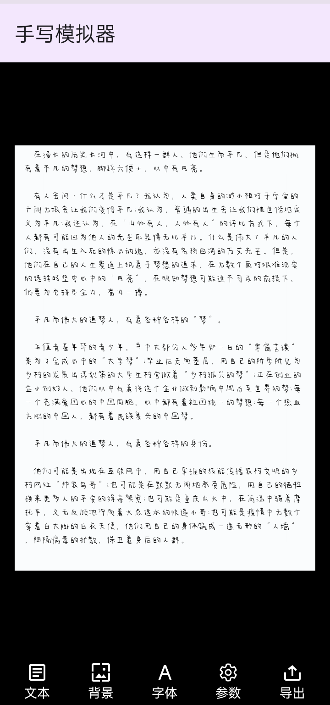

# HandwritingSimulator
手写模拟器（HandwritingSimulator），一款模拟手写笔迹效果的工具，适用于生成接近人工手写风格的文本/笔迹内容，支持自定义背景、字体、笔迹参数。

## 预览
[//]: # (![Screenshot]&#40;./images/preview.png&#41;)


## 项目结构
```
java/
    └── com/
        └── app/
            └── handwritingsimulator/
                ├── BackgroundSelectFragment.java   # 背景选择
                ├── FontSelectFragment.java         # 字体选择
                ├── HandwritingActivity.java        # 主UI
                ├── HandwritingView.java            # 图像绘制
                ├── ParamsAdjustFragment.java       # 参数调整
                └── TextInputFragment.java          # 文本输入
```

## Thanks
[ColorPickerDialog](https://github.com/fennifith/ColorPickerDialog)